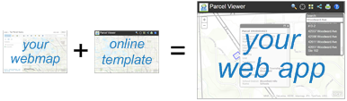

# How Do I...? #

### *If only the template did....* ###

[Web Application Templates](http://www.arcgis.com/home/gallery.html#c=esri&t=apps&f=configurable) take you from map to app easily.

But what if you want more customization than the configuration offers?  Is there an alternative to downloading the whole template and reworking it? Yes!

We have a collection of articles that show how you can customize the ArcGIS Online Solutions set of web applications templates whether they are hosted by ArcGIS.com or by you.

*  [How Do I *article*?](placeholder.md)

Each article is accompanied by a configuration file available from the [Solutions online apps GitHub site](https://github.com/Esri/local-government-online-apps) where you'll also find all of the source code.